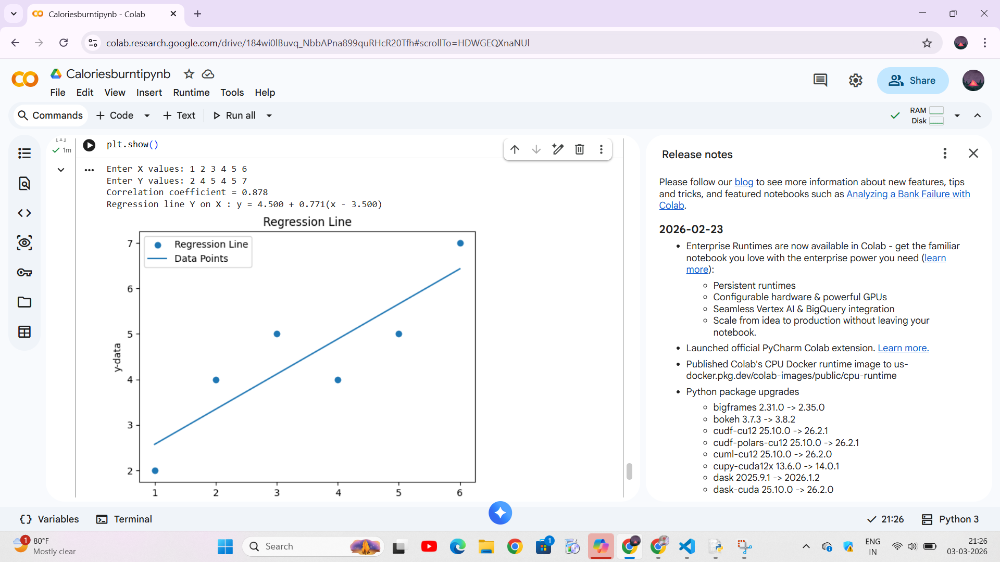

# Correlation and regression for data analysis
# DATE :03.03.2026
# Aim : 

To analyse given data using coeffificient of correlation and regression line


# Software required :  

Python

# Theory:

Correlation describes the strength of an association between two variables, and is completely symmetrical, the correlation between A and B is the same as the correlation between B and A. However, if the two variables are related it means that when one changes by a certain amount the other changes on an average by a certain amount.  

If y represents the dependent variable and x the independent variable, this relationship is described as the regression of y on x. The relationship can be represented by a simple equation called the regression equation. The regression equation representing how much y changes with any given change of x can be used to construct a regression line on a scatter diagram, and in the simplest case this is assumed to be a straight line.

# Procedure :


# Program :


```
import numpy as np
import matplotlib.pyplot as plt
import math

x = [int(i) for i in input("Enter X values: ").split()]
y = [int(i) for i in input("Enter Y values: ").split()]

N = len(x)

Sx = Sy = Sxy = Sx2 = Sy2 = 0

for i in range(N):
    Sx += x[i]
    Sy += y[i]
    Sxy += x[i]*y[i]
    Sx2 += x[i]**2
    Sy2 += y[i]**2
r = (N*Sxy - Sx*Sy) / (math.sqrt(N*Sx2 - Sx**2) * math.sqrt(N*Sy2 - Sy**2))
print("Correlation coefficient =", round(r,3))

byx = (N*Sxy - Sx*Sy) / (N*Sx2 - Sx**2)

xmean = Sx/N
ymean = Sy/N

print(f"Regression line Y on X : y = {ymean:.3f} + {byx:.3f}(x - {xmean:.3f})")

# Plot
plt.scatter(x, y)

def Reg(x):
    return ymean + byx*(x - xmean)

x1 = np.linspace(min(x), max(x), 50)
y1 = Reg(x1)

plt.plot(x1, y1)
plt.xlabel('x-data')
plt.ylabel('y-data')
plt.title('Regression Line')
plt.legend(['Regression Line','Data Points'])

plt.show()
```

# Output 

# RESULT
To analyse given data using coeffificient of correlation and regression line is done successfully using python.
